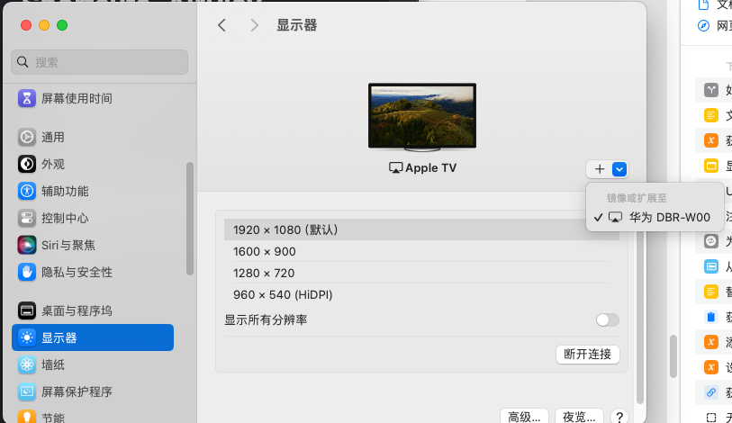
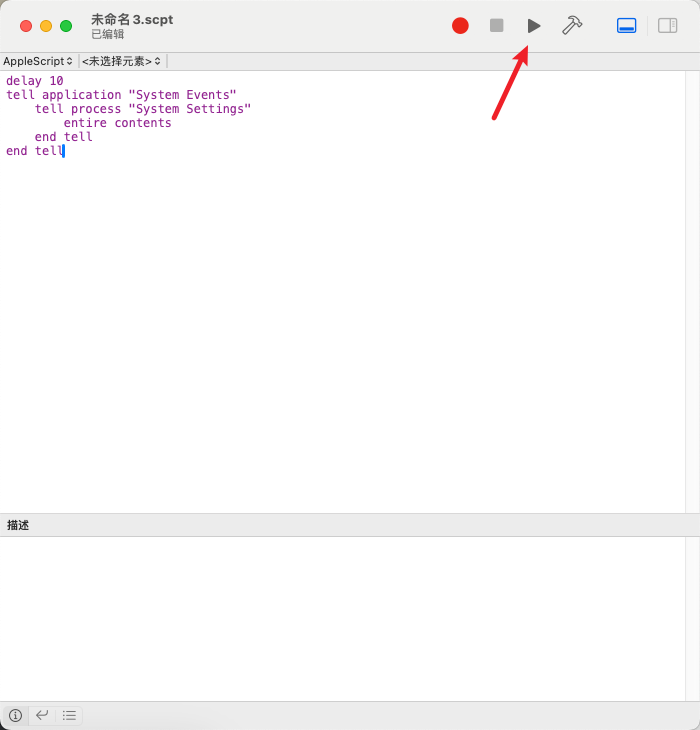
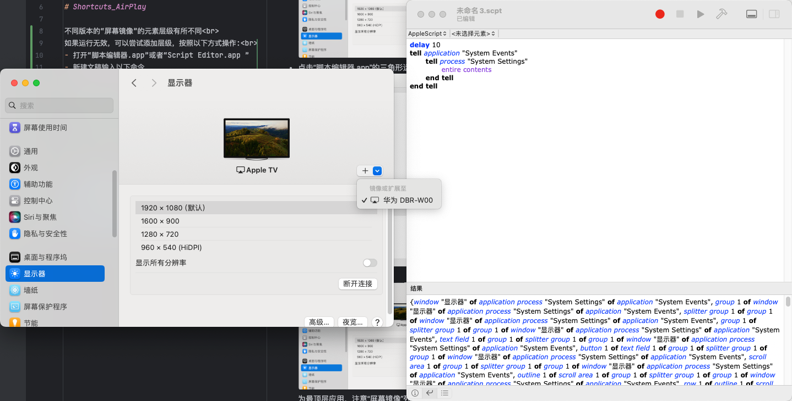
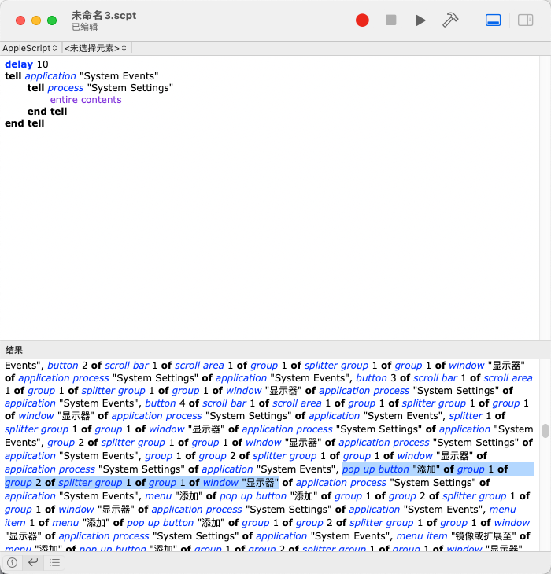
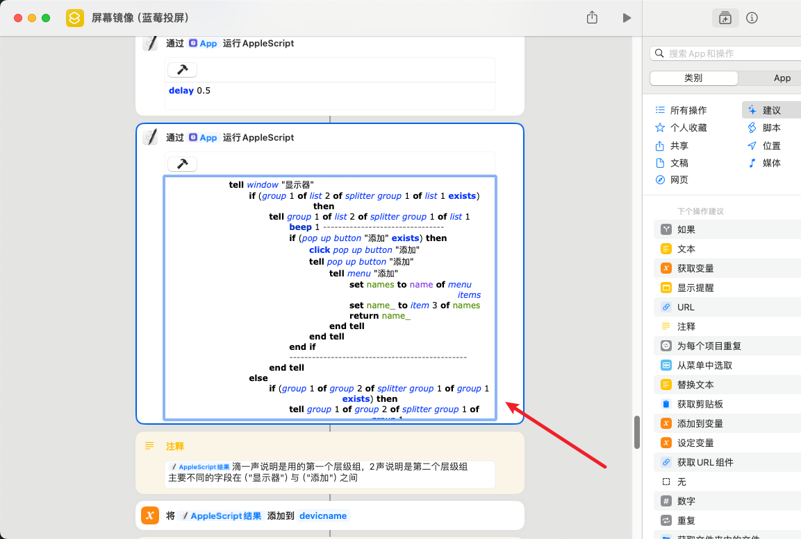
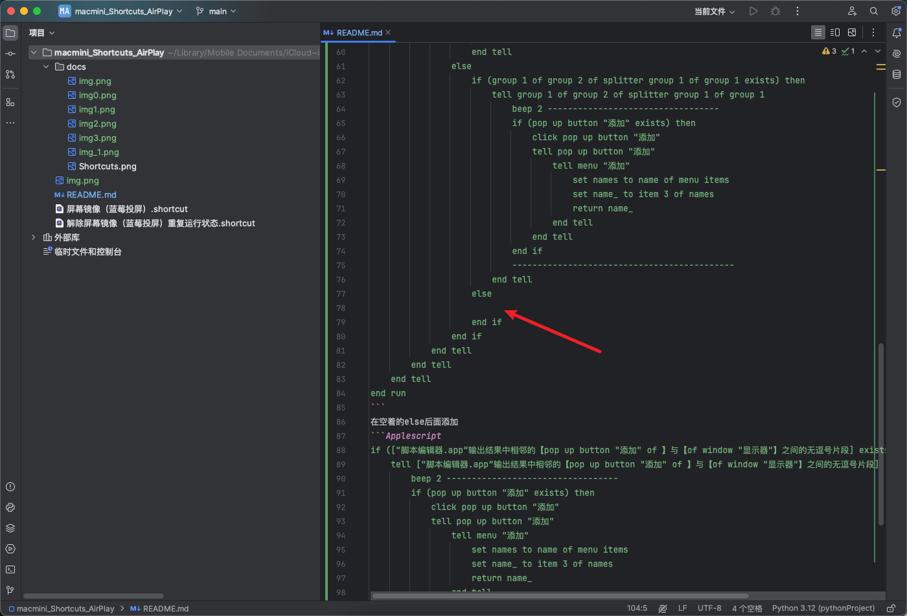

<!-- markdownlint-disable MD033 MD041 -->
<p align="center">
  <a href="https://github.com/lanyangyin/macmini_Shortcuts_AirPlay"></a>
</p>

# Shortcuts_AirPlay
## 每次先运行“解除屏幕镜像（蓝莓投屏）重复运行状态.shortcut”，防止请求不必要权限
不同版本的“屏幕镜像”的元素层级有所不同<br>
如果运行无效，可以尝试添加层级，按照以下方式操作:<br>
- 打开“脚本编辑器.app”或者“Script Editor.app ”
- 新建文稿输入以下命令
```AppleScript
delay 10
tell application "System Events"
    tell process "System Settings"
        entire contents
    end tell
end tell
```
- 打开系统设置，并确认屏幕镜像设备在显示器“屏幕镜像”列表中

- 点击“脚本编辑器.app”的三角形运行按钮，如若请求权限，注意全部允许后重新运行

- 10s内使为最顶层应用，注意“屏幕镜像”列表要点开
- 运行画面应该如：
- 找到“脚本编辑器.app”输出结果中相邻的【pop up button "添加" of 】与【of window "显示器"】之间的无逗号片段。注意语句前后，事例这一段就是
```
group 1 of group 2 of splitter group 1 of group 1
```
- 使用“快捷指令.app”编辑“屏幕镜像（蓝莓投屏）.shortcut”
- 找到这一个区块：，内容为：
```AppleScript
on run {input, parameters}
	set addstrhave to 0
	-- 使用 "System Events" 与 "System Settings" 应用程序交互
	tell application "System Events"
		-- 在 "System Settings" 进程中查找 "显示器" 菜单项并点击
		tell process "System Settings"
			tell menu bar item "显示" of menu bar 1
				click menu item "显示器" of menu "显示"
			end tell
			-- 等待一小段时间，以便菜单项加载
			delay 1
			-- 在 "显示器" 窗口中查找目标组件
			tell window "显示器"
				if (group 1 of list 2 of splitter group 1 of list 1 exists) then
					tell group 1 of list 2 of splitter group 1 of list 1
						beep 1 --------------------------------
						if (pop up button "添加" exists) then
							click pop up button "添加"
							tell pop up button "添加"
								tell menu "添加"
									set names to name of menu items
									set name_ to item 3 of names
									return name_
								end tell
							end tell
						end if
						-----------------------------------------------
					end tell
				else
					if (group 1 of group 2 of splitter group 1 of group 1 exists) then
						tell group 1 of group 2 of splitter group 1 of group 1
							beep 2 ----------------------------------
							if (pop up button "添加" exists) then
								click pop up button "添加"
								tell pop up button "添加"
									tell menu "添加"
										set names to name of menu items
										set name_ to item 3 of names
										return name_
									end tell
								end tell
							end if
							--------------------------------------------
						end tell
					else
						
					end if
				end if
			end tell
		end tell
	end tell
end run
```
在空着的else后面添加
```Applescript
if ([“脚本编辑器.app”输出结果中相邻的【pop up button "添加" of 】与【of window "显示器"】之间的无逗号片段] exists) then
    tell [“脚本编辑器.app”输出结果中相邻的【pop up button "添加" of 】与【of window "显示器"】之间的无逗号片段] 
        beep 2 ----------------------------------
        if (pop up button "添加" exists) then
            click pop up button "添加"
            tell pop up button "添加"
                tell menu "添加"
                    set names to name of menu items
                    set name_ to item 3 of names
                    return name_
                end tell
            end tell
        end if
        --------------------------------------------
    end tell
else
    
end if
```
